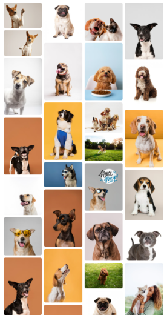
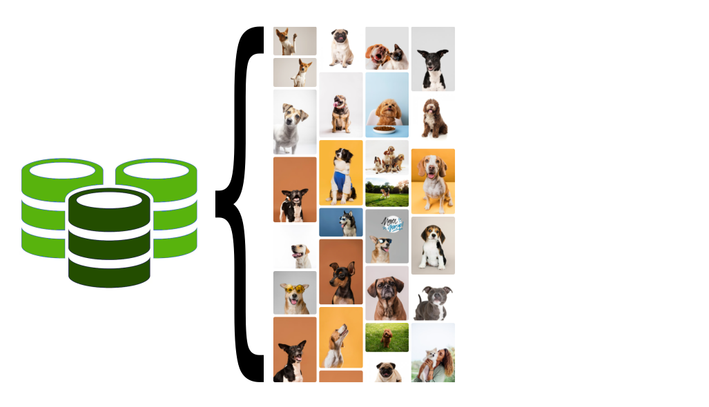
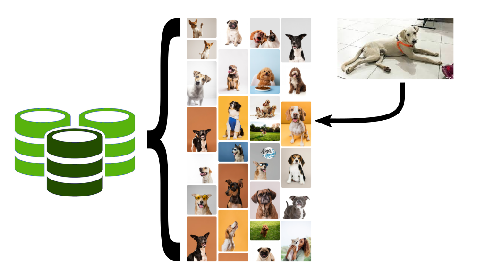
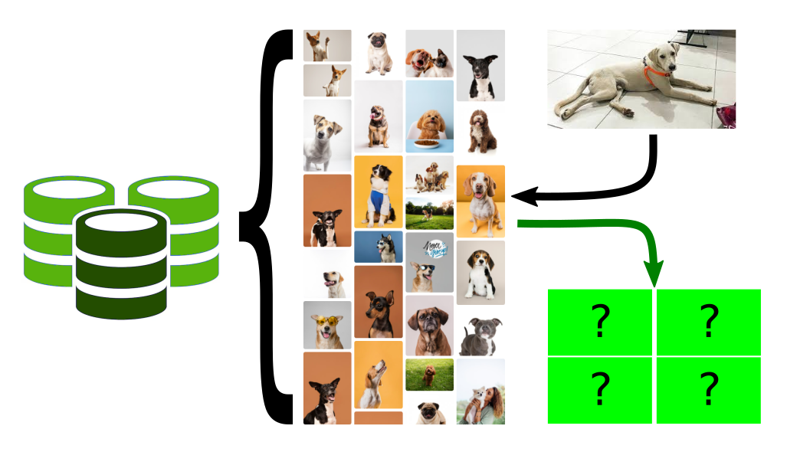
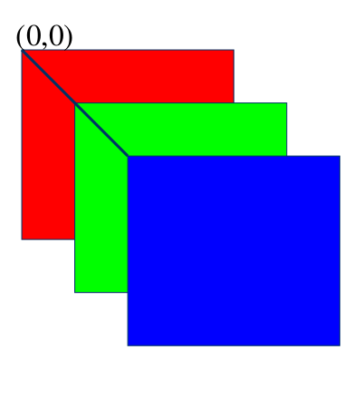
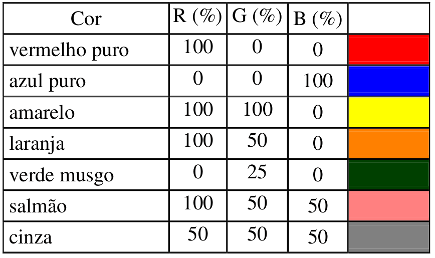
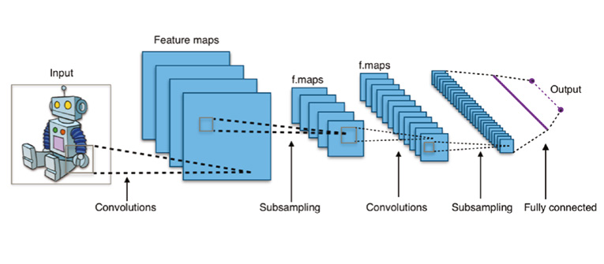
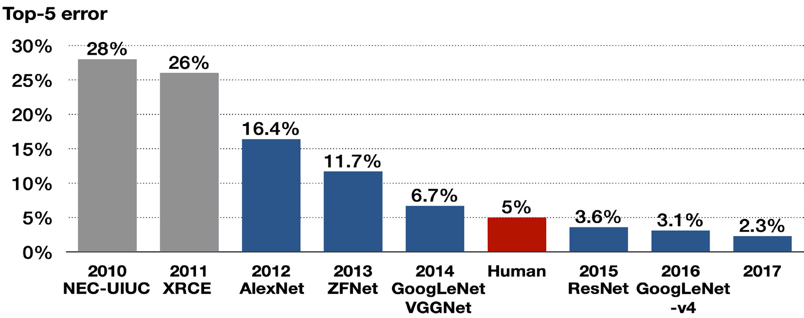
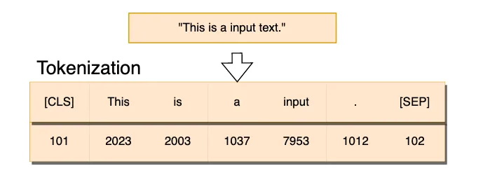
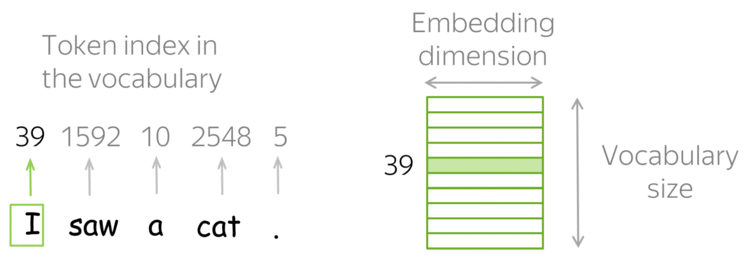

##  {background-image="images/capa.png" background-opacity="1" background-size="80%"}

##  {background-image="images/capa_pb.png" background-opacity=".1" background-size="80%"}

 
 

<h2 style= "color:#0000fd;">Similaridade de Imagens usando Vision Transformers no python</h2>

   
<h3>Jodavid Ferreira</h3>
<h4>Departamento de Estatística</h4>
<h4>Universidade Federal de Pernambuco</h4>

<!---

         

{.absolute bottom="180" right="0" width="700"}

<h2 style="text-align: left"> O que é </h2>
<h2 style="text-align: left"> Ciência de </h2>
<h2 style="text-align: left"> Dados? </h2>

--->

## 
<h2 style= "color:#0000fd;">Ideia neste tutorial</h2>

{.fixed height="100%"}

---

## 
<h2 style= "color:#0000fd;">Ideia neste tutorial</h2>

{.fixed width="90%"}

. . .

{.fixed width="700px"}

---

## 
<h2 style= "color:#0000fd;">Ideia neste tutorial</h2>

{.fixed width="100%"}

---

## 
<h2 style= "color:#0000fd;">Ideia neste tutorial</h2>

{.fixed width="100%"}

---

## 
<h2 style= "color:#0000fd;">Imagens digitais</h2>

 

#### Espaço RGB de Cores

:::: {.columns}

::: {.column width="50%"}

{.absolute width="450"}

:::

::: {.column width="50%"}

- Um único pixel consiste de
três componentes que
variam entre [0,255].

- Cada *pixel* e um vetor:

{.absolute width="550"}

 
 
 
 

Vetor-pixel na
memória do
computador

Pixel na
imagem

:::

::::

---

## 
<h2 style= "color:#0000fd;">Imagens digitais</h2>

 

:::: {.columns}

::: {.column width="50%"}

{.absolute left=15%  width="300"}

Imagem Original

{.absolute left=15% bottom=5% width="300"}

Componente - G

:::

::: {.column width="50%"}

{.absolute right=15% width="300"}

Componente - R

{.absolute right=15% bottom=5% width="300"}

Componente - B

:::

::::

---

## 
<h2 style= "color:#0000fd;">Imagens digitais</h2>

 

**Representação como pontos de um espaço 3D de Cor**

Cores criadas com o vetor cromático R,G,B

---

## 
<h2 style= "color:#0000fd;">Imagens digitais</h2>

$$
C=r\color{red}R+g\color{green}G+b\color{blue}B
$$

onde $\color{red}R$, $\color{green}G$ e $\color{blue}B$ são as cores primarias e $r$, $g$ e $b$ os coeficientes da mistura.

- Em geral define-se em três como o número de cores primarias em um espaço,
devido ao fato do olho humano possuírem três tipos de fotorreceptores.

- A partir destas cores primarias, é possível gerar todas as outras cores do espaço.

Entretanto, existem outras formas de representar cores, como o espaço CMYK.

- O padrão RGB tem síntese aditiva, e é conhecido como cor luz, pois quando as três cores são sobrepostas formam o branco. Já o CMY tem síntese substrativa (também conhecido como pigmento), pois quando sobrepostas, as três cores formam a cor preto (K).
  
  - Que são as cores que são utilizadas em impressoras.

. . .

---

## 
<h2 style= "color:#0000fd;">Redes Neurais Convolucionais</h2>

 

#### Um pouco de história

- O **ImageNet Large-Scale Visual Recognition Challenge (ILSVRC)** era uma competição anual de reconhecimento visual em larga escala, que começou em 2010-2017. A competição era baseada no banco de dados ImageNet, que contém milhões de imagens anotadas em milhares de categorias.

- Em 2012, a equipe da Universidade de Toronto, liderada por Alex Krizhevsky, Ilya Sutskever e Geoffrey Hinton, desenvolveu uma CNN chamada **AlexNet** ([paper](https://proceedings.neurips.cc/paper_files/paper/2012/file/c399862d3b9d6b76c8436e924a68c45b-Paper.pdf)), que obteve uma precisão de erro de 16,4%, superando significativamente os métodos tradicionais e significativamente melhor que o segundo colocado do mesmo ano, que teve uma taxa de erro de 26,2%.

---

## 
<h2 style= "color:#0000fd;">Redes Neurais Convolucionais</h2>

{.fixed width=60%}

-  A Figura acima mostra uma arquitetura típica de uma rede neural convolucional que contém uma camada de entrada, camadas convolucionais, camadas de pooling (subamostragem, ou down sampling), camadas de ativação, camadas totalmente conectadas e uma camada de saída.

---

## 
<h2 style= "color:#0000fd;">Redes Neurais Convolucionais</h2>

 

{.fixed width=60%}

---

## 
<h2 style= "color:#0000fd;">Redes Neurais Convolucionais</h2>

 

- As Redes Neurais Convolucionais (CNNs) continuaram atraindo a atenção após vencerem o Desafio ImageNet até o ano de 2017.

- Existiam 50.000 imagens coloridas de alta resolução em 1.000 categorias;

- O treinamento com 1,2 milhão de imagens;

- Em 2017, a SENet (<https://arxiv.org/abs/1709.01507>) alcançou uma taxa de erro de 2,3% em 2017.

{.fixed }

---

## 
<h2 style= "color:#0000fd;">ViT - Visual Transformers</h2>

---

## 
<h2 style= "color:#0000fd;"> Tokens e Embeddings</h2>

- *Tokens* e *Embeddings* são a base dos modelos baseados em atenção e *transformers*.

. . .

A **tokenização** é o processo de pegar o texto e transformar as sequências de entrada para números.

  - é um mapeamento direto de *palavras* para números, a mesma palavra vai receber o mesmo *token* (pode ser modelado, mas rapidamente se torna muito grande).
  - os *tokens* geralmente são palavras, mas também podem ser frases, sinais de pontuação ou até caracteres individuais.
  - A tokenização é o primeiro passo no processamento de linguagem natural (NLP) e é essencial para a pré-processamento de texto.
  - ela ajuda a preparar os dados textuais para análise, tornando-os mais estruturados e fáceis de trabalhar.

---

## 
<h2 style= "color:#0000fd;"> Tokens e Embeddings</h2>

{style="margin: 0 0 0 300px; width: 500px; height: auto;"}

Apesar da referẽncia, palavras grandes podem ser divididas em *subtokens* menores, sendo assim, em 1.000 tokens de palavras em português correspondem aproximadamente a 700 a 750 palavras do nosso idioma.

Essa contagem de palavras em um texto pode variar bastante dependendo da linguagem, do tamanho das palavras e do uso de pontuações.

::: {style="align-items: center;"}
{style="margin: 0 0 0 300px; width: 500px; height: auto;"}
:::

---

## 
<h2 style= "color:#0000fd;"> Tokens e Embeddings</h2>

   - *Embeddings* são vetores numéricos obtidos dos *tokens* e representam palavras, frases ou documentos.

- Os *embeddings* é o processo de transformar o mapeamento do vetor de texto de entrada na matriz de embeddings^[Alguns modelos já incorporam o processo de tokenização.].

- Os *embeddings* faz uma representação mais rica do relacionamento entre os tokens (pode limitar o tamanho e pode ser aprendida).

- Os *embeddings* conseguem capturar a estrutura semântica das palavras ou frases e suas relações no texto.

- Atualmente, elas são criadas usando técnicas de *machine learning*, como Word2Vec ou GloVe e *deep learning*, como BERT, GPT-3, e os modelos mais atuais de LLMs.

---

## 
<h2 style= "color:#0000fd;"> Tokens e Embeddings</h2>

---

## 
<h2 style= "color:#0000fd;"> Tokens e Embeddings</h2>

 

:::: {.columns}

::: {.column width="50%"}

- As *word embeddings* transformam os valores inteiros únicos obtidos a partir do tokenizador em um array $n$-dimensional.

- Por exemplo, a palavra 'gato' pode ter o valor '20' a partir do tokenizador, mas a camada de *embedding*  utilizará todas as palavras no seu vocabulário associadas a 'gato' para construir o vetor de *embeddings*. Ela encontra "dimensões" ou características, como "ser vivo", "felino", "humano", "gênero", etc.

- Assim, a palavra 'gato' terá valores diferentes para cada dimensão/característica.

:::

::: {.column width="3%"}
:::

::: {.column width="47%"}

{style="margin: 0 0 0 0; width:1550px;"}

:::

::::

---

## 
<h2 style= "color:#0000fd;"> Tokens e Embeddings</h2>

:::: {.columns}

::: {.column width="50%"}

Detalhes importantes:

Similaridade do Cosseno ($Sim_{cos}$):

- Maior valor (próximo de 1): Maior similaridade.
- Menor valor (próximo de -1): Maior dissimilaridade.

Distância do Cosseno ($D_{cos} = 1 - Sim_{cos}$):

- Maior valor (próximo de 2): Maior dissimilaridade.
- Menor valor (próximo de 0): Maior similaridade.

:::

::: {.column width="3%"}
:::

::: {.column width="47%"}

 

{style="margin: 0 0 0 0; width:550px;"}
 

{style="margin: 0 0 0 0; width:550px;"}

:::

::::

------------------------------------------------------------------------

   

<h1 style="text-align: center;">

OBRIGADO!

</h1>

::: {style="text-align: center"}
Slide produzido com [quarto](https://quarto.org/)
:::

             
