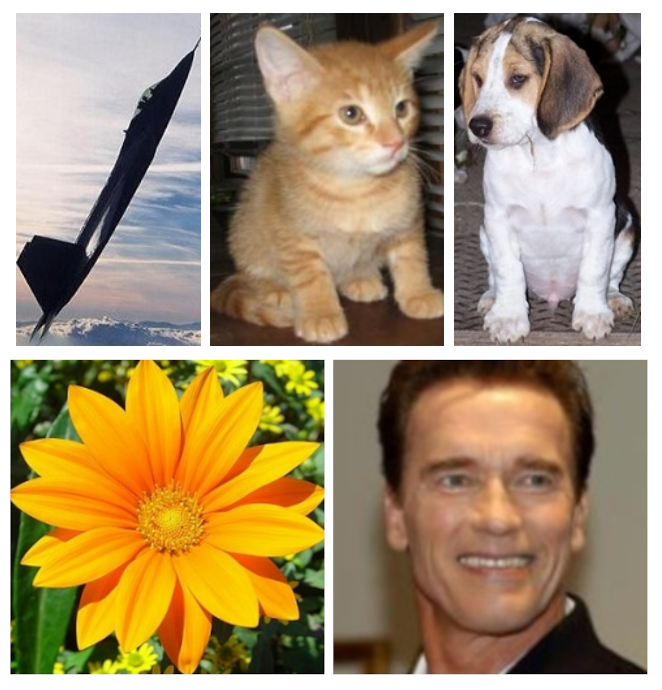

# Base de dados {.unnumbered}

A seguir é descrito informações sobre a base de dados utilizada nesse tutorial.

O conjunto de dados criado é considerado referência (*benchmark*) para o trabalho *Effects of Degradations on Deep Neural Network Architectures* [@roy2018effects].

A base de dados foi nomeada de **Natural Images** e pode ser encontrada no Kaggle e no Github.

- Link do kaggle: <https://www.kaggle.com/datasets/prasunroy/natural-images>
- Link do github: <https://github.com/prasunroy/cnn-on-degraded-images?tab=readme-ov-file>

Uma descrição da base dados retirada do paper @roy2018effects é a seguinte:

> O conjunto de dados ImageNet [@deng2009imagenet] é um padrão moderno de larga escala para avaliar redes neurais profundas. As redes neurais convolucionais (CNNs) de última geração (*State-of-the-art*) são geralmente treinadas e validadas em 1000 classes de objetos do ImageNet. Mais recentemente, as redes de cápsulas (*capsule networks*) [@sabour2017dynamic] relatam taxas de reconhecimento muito altas para classificação de imagens. No entanto, devido à natureza do novo algoritmo de roteamento dinâmico, treinar e validar redes de cápsulas em 1000 classes é extremamente difícil. Portanto, para estudar as redes de cápsulas em conjunto com as CNNs, um conjunto de dados com um número menor de classes é mais adequado. Um candidato potencial é o conjunto de dados CIFAR-10 [@krizhevsky2009learning], que consiste em 10 classes de objetos. Contudo, o CIFAR-10 inclui apenas imagens de baixa resolução de $32 \times 32$, tornando-o uma escolha inadequada, semelhante ao MNIST, para testar (*benchmarking*) redes muito profundas. **Por essas razões, compilamos um conjunto de dados de imagens do mundo real de alta resolução de 8 classes diversas. O conjunto de dados contém 6899 amostras de imagens de aviões (727), carros (968), gatos (885), cães (702), flores (843), frutas (1000), motos (788) e pessoas (986). Utilizamos 5724 imagens para treinamento e 1175 imagens para validação em nossos experimentos.**

A Figura 1 acima mostra algumas imagens do conjunto de dados. As imagens para compor
*Natural Images* foram obtidas nos seguintes locais:

- Imagens de aviões foram obtidas de <http://host.robots.ox.ac.uk/pascal/VOC>
- Imagens de carro foram obtidas de <https://ai.stanford.edu/~jkrause/cars/car_dataset.html>
- Imgens de gato foram obtidas de <https://www.kaggle.com/c/dogs-vs-cats>
- Imagens de cachorro foram obtidas de <https://www.kaggle.com/c/dogs-vs-cats>
- Imagens de flores foram obtidas de <http://www.image-net.org>
- Imagens de frutas foram obtidas de <https://www.kaggle.com/moltean/fruits>
- Imagens de moto foram obtidas de <http://host.robots.ox.ac.uk/pascal/VOC>
- Imagens de pessoas foram obtidas de <http://www.briancbecker.com/blog/research/pubfig83-lfw-dataset>