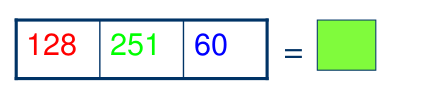
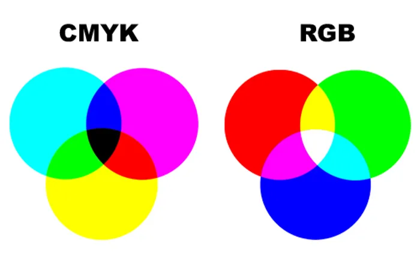
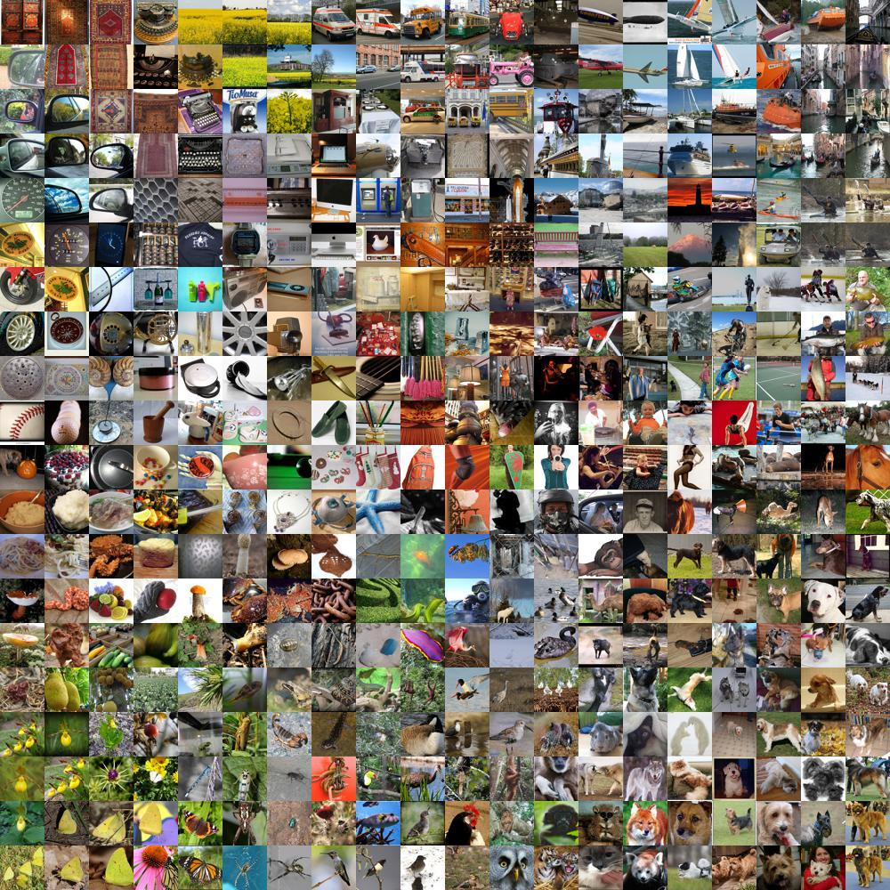
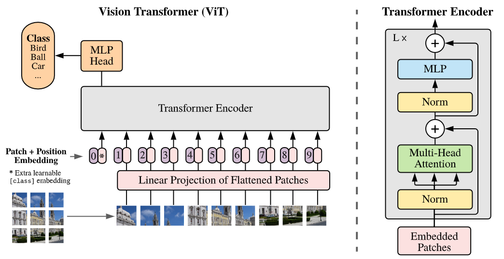
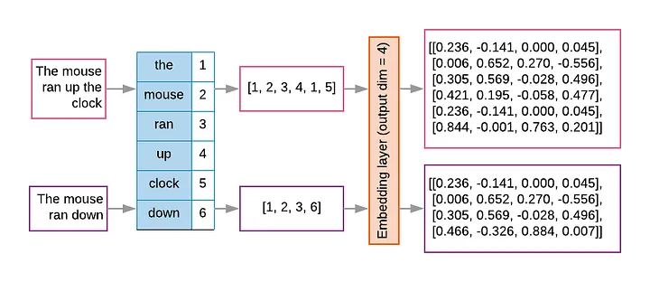
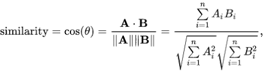
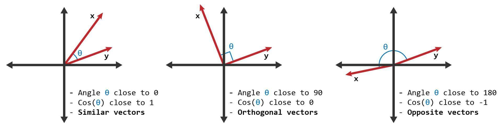
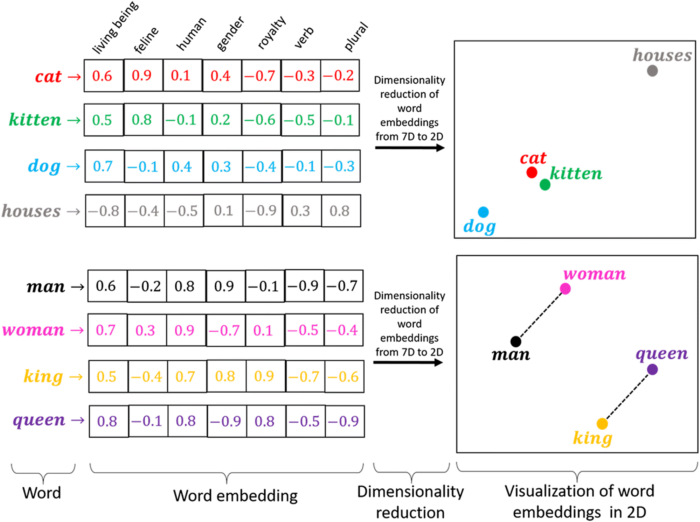

##  {background-image="images/capa.png" background-opacity="1" background-size="80%"}

##  {background-image="images/capa_pb.png" background-opacity=".1" background-size="80%"}

 
 

<h2 style= "color:#0000fd;">Similaridade de Imagens usando Vision Transformers no python</h2>

   
<h3>Jodavid Ferreira</h3>
<h4>Departamento de Estatística</h4>
<h4>Universidade Federal de Pernambuco</h4>

<!---

         

{.absolute bottom="180" right="0" width="700"}

<h2 style="text-align: left"> O que é </h2>
<h2 style="text-align: left"> Ciência de </h2>
<h2 style="text-align: left"> Dados? </h2>

--->

## 
<h2 style= "color:#0000fd;">Início</h2>

 

- Maio/2024;
- Enchente no Rio Grande do Sul;

. . .

{.fixed width=500px}

. . .

- Muitas pessoas desabrigadas;
- Muitos animais perdidos de seus donos;

. . .

{.fixed width=500px}

---

## 
<h2 style= "color:#0000fd;">Ideia neste tutorial</h2>

{.fixed width="900px"}
<h3> Fazer Scraping de Imagens</h3>

---

## 
<h2 style= "color:#0000fd;">Ideia neste tutorial</h2>

{.fixed height="100%"}

---

## 
<h2 style= "color:#0000fd;">Ideia neste tutorial</h2>

{.fixed width="90%"}

. . .

{.fixed width="700px"}

---

## 
<h2 style= "color:#0000fd;">Ideia neste tutorial</h2>

{.fixed width="100%"}

---

## 
<h2 style= "color:#0000fd;">Ideia neste tutorial</h2>

{.fixed width="100%"}

---

## 
<h2 style= "color:#0000fd;">Desafio com as imagens</h2>

 

:::: {.columns}

::: {.column width="48%"}
{.fixed width="500"}
:::

::: {.column width="48%"}
{.fixed width="500"}
:::

::::

<h3 style="text-align:center; color:red;"> Como posso garantir que nessas duas imagens estão o mesmo animal?</h3>

---

## 
<h2 style= "color:#0000fd;">Imagens digitais</h2>

 

:::: {.columns}

::: {.column width="50%"}

{.absolute left=15%  width="300"}

Imagem Original

{.absolute left=15% bottom=5% width="300"}

Componente - G

:::

::: {.column width="50%"}

{.absolute right=15% width="300"}

Componente - R

{.absolute right=15% bottom=5% width="300"}

Componente - B

:::

::::

---

## 
<h2 style= "color:#0000fd;">Imagens digitais</h2>

 

#### Espaço RGB de Cores

:::: {.columns}

::: {.column width="50%"}

{.absolute width="450"}

:::

::: {.column width="50%"}

- Um único pixel consiste de
três componentes que
variam entre [0,255].

- Cada *pixel* e um vetor:

{.absolute width="550"}

 
 
 
 

Vetor-pixel na
memória do
computador

Pixel na
imagem

:::

::::

---

## 
<h2 style= "color:#0000fd;">Imagens digitais</h2>

 

- Em geral define-se em três como o número de cores primarias em um espaço,
devido ao fato do olho humano possuírem três tipos de fotorreceptores.

- A partir destas cores primarias, é possível gerar todas as outras cores do espaço.

**Representação como pontos de um espaço 3D de Cor**

Cores criadas com o vetor R,G,B

{.fixed width="400px"}

---

## 
<h2 style= "color:#0000fd;">Imagens digitais</h2>

Entretanto, existem outras formas de representar cores, como o espaço CMYK.

- O padrão RGB tem síntese aditiva, e é conhecido como cor luz, pois quando as três cores são sobrepostas formam o branco. Já o CMY tem síntese substrativa (também conhecido como pigmento), pois quando sobrepostas, as três cores formam a cor preto (K).
  
  - Que são as cores que são utilizadas em impressoras.

. . .

---

 
 
 
 
 

<h2 style= "text-align:center; color:#0000fd;">Processamento de Imagens com </h2>
<h2 style= "text-align:center;  color:#0000fd;">*Deep Learning*</h2>

 

---

## 
<h2 style= "color:#0000fd;">Redes Neurais Convolucionais</h2>

 

#### Um pouco de história

- O **ImageNet Large-Scale Visual Recognition Challenge (ILSVRC)** era uma competição anual de reconhecimento visual em larga escala, que começou em 2010 e ocorreu até 2017. A competição era baseada no banco de dados ImageNet, que contém milhões de imagens anotadas em milhares de categorias.

:::: {.columns}

::: {.column width="60%"}

{.fixed width=35%}

:::
::: {.column width="40%"}

- O dataset ImageNet contém 14.197.122 imagens rotuladas, com 20.000 categorias de objetos, sendo que cada categoria contém pelo menos 500 imagens.
:::
::::

---

## 
<h2 style= "color:#0000fd;">Redes Neurais Convolucionais</h2>

 

#### Um pouco de história

- Em 2012, a equipe da Universidade de Toronto, liderada por Alex Krizhevsky, Ilya Sutskever e Geoffrey Hinton, desenvolveu uma CNN chamada **AlexNet** ([paper](https://proceedings.neurips.cc/paper_files/paper/2012/file/c399862d3b9d6b76c8436e924a68c45b-Paper.pdf)), que obteve uma precisão de erro de 16,4%, superando significativamente os métodos tradicionais e significativamente melhor que o segundo colocado do mesmo ano, que teve uma taxa de erro de 26,2%.

{.fixed width=55%}

---

## 
<h2 style= "color:#0000fd;">Redes Neurais Convolucionais</h2>

 

- As Redes Neurais Convolucionais (CNNs) continuaram atraindo a atenção após vencerem o Desafio ImageNet até o ano de 2017.

<!-- - Existiam 50.000 imagens coloridas de alta resolução em 1.000 categorias;

- O treinamento com 1,2 milhão de imagens; -->

- Em 2017, a SENet (<https://arxiv.org/abs/1709.01507>) alcançou uma taxa de erro de 2,3% em 2017.

{.fixed width=65%}

---

## 
<h2 style= "color:#0000fd;">Redes Neurais Convolucionais</h2>

{.fixed width=60%}

-  A Figura acima mostra uma arquitetura típica de uma rede neural convolucional que contém uma camada de entrada, camadas convolucionais, camadas de pooling (subamostragem, ou down sampling), camadas de ativação, camadas totalmente conectadas e uma camada de saída.

<!-- 
---

## 
<h2 style= "color:#0000fd;">Redes Neurais Convolucionais</h2>

 

 -->

---

## 
<h2 style= "color:#0000fd;">ViT - Visual Transformers</h2>

 

- **Junho/2021:** Autores da Google Research publicaram o artigo "An Image is Worth 16x16 Words: Transformers for Image Recognition at Scale" ([paper](https://arxiv.org/abs/2010.11929)).

- Segundo os autores, inspirados pelos sucessos do escalonamento de Transformers em NLP (Processamento de Linguagem Natural), experimentaram aplicar um Transformer padrão diretamente às imagens, com o mínimo de modificações possível.

<!-- Para isso, dividimos uma imagem em patches e fornecemos a sequência de embeddings lineares desses patches como entrada para um Transformer. Patches de imagem são tratados da mesma forma que tokens (palavras) em uma aplicação de NLP. Treinamos
o modelo em classificação de imagens de forma supervisionada. -->

{.fixed width=50%}

<!-- Figura 1: Visão geral do modelo. Dividimos uma imagem em fragmentos de tamanho fixo, incorporamos linearmente cada um deles, adicionamos embeddings de posição e alimentamos a sequência de vetores resultante em um codificador Transformer padrão. Para realizar a classificação, usamos a abordagem padrão de adicionar um "token de classificação" extra aprendível à sequência. A ilustração do codificador Transformer foi inspirada em Vaswani et al. -->

---

## 
<h2 style= "color:#0000fd;"> Tokens e Embeddings</h2>

- *Tokens* e *Embeddings* são a base dos modelos baseados em atenção e *transformers*.

. . .

No contexto textual, a **tokenização** é o processo de pegar o texto e transformar as sequências de entrada em representação numérica.

  - é um mapeamento direto de *palavras* para números, uma mesma palavra vai receber o mesmo *token* (pode ser modelado, mas rapidamente se torna muito grande).
  - os *tokens* geralmente são palavras, mas também podem ser frases, sinais de pontuação ou até caracteres individuais.
  - A tokenização é o primeiro passo no processamento de linguagem natural (NLP) e é essencial para a pré-processamento de texto.
  - ela ajuda a preparar os dados textuais para análise, tornando-os mais estruturados.

---

## 
<h2 style= "color:#0000fd;"> Tokens e Embeddings</h2>

{style="margin: 0 0 0 300px; width: 450px; height: auto;"}

Apesar da referência, palavras grandes podem ser divididas em *subtokens* menores, sendo assim, em 1.000 tokens de palavras em português correspondem aproximadamente a aproximadamente 700 a 750 palavras do nosso idioma.

Essa contagem de palavras em um texto pode variar dependendo da linguagem, do tamanho das palavras e do uso de pontuações.

::: {style="align-items: center;"}
{style="margin: 0 0 0 300px; width: 450px; height: auto;"}
:::

---

## 
<h2 style= "color:#0000fd;"> Tokens e Embeddings</h2>

   - *Embeddings* são vetores numéricos obtidos dos *tokens* e representam palavras, frases ou documentos.

- Os *embeddings* é o processo de transformar o mapeamento do vetor de texto de entrada em uma representação matricial^[Alguns modelos já incorporam o processo de tokenização.].

- Os *embeddings* possuem uma melhor representação do relacionamento entre os tokens.

- Os *embeddings* conseguem capturar a estrutura semântica das palavras ou frases e suas relações no texto.

- Atualmente, elas são criadas usando técnicas de *machine learning*, como Word2Vec ou GloVe e *deep learning*, como BERT, GPT-3, e os modelos mais atuais de LLMs.

<!-- 
---

## 
<h2 style= "color:#0000fd;"> Tokens e Embeddings</h2>

--- -->

## 
<h2 style= "color:#0000fd;"> ViT: Uma ideia inspirada no BERT</h2>

 

O **Vision Transformer (ViT)** aplica uma ideia originalmente desenvolvida para **texto** — o **BERT** — no mundo da **visão computacional**.

 

Ambos os modelos usam o mesmo conceito central:  
- **"Compreender partes (tokens ou patches) em relação ao todo usando atenção."**

. . .

 

<h3  style= "color:#0000fd;">  O que é o BERT?</h3>

**BERT** (*Bidirectional Encoder Representations from Transformers*) é um modelo de linguagem criado pela [Google (2018)](https://research.google/blog/open-sourcing-bert-state-of-the-art-pre-training-for-natural-language-processing/) para **compreender texto com base no contexto completo**.

---

## 
<h2 style= "color:#0000fd;">BERT</h2>

 

- o BERT **olha para toda a frase ao mesmo tempo** (bidirecionalidade)
  - ao contrário de modelos que leem da **esquerda para a direita**, 

- Isso permite entender o **significado exato de uma palavra**, considerando tudo o que está antes **e depois** dela.

  - Frase 1: "*Ele sentou no banco para descansar.*"  
  - Frase 2: "*Ele foi ao banco sacar dinheiro.*"

- Mesmo a palavra **"banco"** sendo igual, o significado muda.  

- O BERT entende isso porque ele **considera todas as palavras da frase ao mesmo tempo**.

---

## 
<h2 style= "color:#0000fd;"> Como o BERT funciona internamente?</h2>

 

O BERT é baseado no **Encoder do Transformer**. Ele utiliza:

 

- **Tokenização**: cada palavra vira um token.
- **Embeddings**: os tokens viram vetores numéricos.
- **Atenção (Self-Attention)**: calcula o quanto cada palavra influencia as outras.
- **Tarefa de treino**: *Masked Language Modeling (MLM)*, onde uma palavra é escondida e o modelo precisa prever qual é.

---

## 
<h2 style= "color:#0000fd;"> A ideia central: tokens + atenção</h2>

 

> "Vamos representar uma sequência de unidades (tokens, patches) como vetores e deixar o modelo **aprender relações entre elas com autoatenção**."

 

Essa ideia permite que o modelo **reconheça padrões globais**, não apenas locais.

 

O ViT **usa exatamente essa mesma lógica**, mas com **imagens** em vez de texto.

---

## 
<h2 style= "color:#0000fd;"> ViT e BERT</h2>

 

| Etapa                   | BERT (Texto)                      | ViT (Imagem)                      |
|-------------------------|------------------------------------|-----------------------------------|
| Entrada                 | Sequência de palavras (tokens)     | Patches da imagem (ex: 16×16 px)  |
| Embedding               | Vetor para cada palavra            | Vetor para cada patch             |
| Posição                 | Embedding de posição adicionado    | Embedding de posição adicionado   |
| Processamento           | Transformer Encoder (atenção)      | Transformer Encoder (atenção)     |
| Pré-treinamento         | Prever palavras (MLM)              | Prever patches (Masked Patch)     |
| Saída                   | Tarefa textual                     | Tarefa visual (ex: classificação) |

---

## 
<h2 style= "color:#0000fd;"> ViT aplicado às imagens?</h2>

 

O **ViT** (Vision Transformer) transforma uma imagem da seguinte forma:

 

1. **Divide a imagem em pequenos blocos** (patches), como se fossem palavras visuais.
2. Cada patch é **transformado em um vetor** (embedding), como o BERT faz com palavras.
3. Esses vetores são alimentados em um **Transformer Encoder**, com camadas de atenção.
4. O modelo aprende a **relacionar todas as partes da imagem** para tomar decisões (ex: classificar, segmentar).

---

## 
<h2 style= "color:#0000fd;"> ViT aplicado às imagens?</h2>

 

O **ViT** (Vision Transformer) transforma uma imagem da seguinte forma:

 

1. **Divide a imagem em pequenos blocos** (patches), como se fossem palavras visuais.

2. Cada patch é **transformado em um vetor** (embedding), como o BERT faz com palavras.

3. Esses vetores são alimentados em um **Transformer Encoder**, com camadas de atenção.
4. O modelo aprende a **relacionar todas as partes da imagem** para tomar decisões (ex: classificar, segmentar).

---

## 
<h2 style= "color:#0000fd;">FAISS</h2>

 

> **FAISS (Facebook AI Similarity Search)** é uma biblioteca criada pelo Facebook AI para fazer **buscas eficientes em grandes conjuntos de vetores** (como *embeddings*).

. . .

<h3 style= "color:#0000fd;">Para que serve?</h3>

Quando você tem **milhões de vetores** (ex: gerados por BERT ou ViT), precisa encontrar **os mais próximos** (similaridade). 

Isso é comum em tarefas como:

- Busca semântica (texto/imagem semelhante)
- Recuperação de imagens por conteúdo
- Sistemas de recomendação baseados em embeddings
<!-- - Deduplicação ou clustering rápido -->

<!-- ---

## 
<h2 style= "color:#0000fd;">Distância do Cosseno</h2>

:::: {.columns}

::: {.column width="50%"}

Detalhes importantes:

Similaridade do Cosseno ($Sim_{cos}$):

- Maior valor (próximo de 1): Maior similaridade.
- Menor valor (próximo de -1): Maior dissimilaridade.

Distância do Cosseno ($D_{cos} = 1 - Sim_{cos}$):

- Maior valor (próximo de 2): Maior dissimilaridade.
- Menor valor (próximo de 0): Maior similaridade.

:::

::: {.column width="3%"}
:::

::: {.column width="47%"}

 

{style="margin: 0 0 0 0; width:550px;"}
 

{style="margin: 0 0 0 0; width:550px;"}

:::

::::

--- -->

## 
<h2 style= "color:#0000fd;">k-NN - vizinhos mais próximos</h2>
<h4 style= "color:#0000fd;">usando similaridade do cosseno</h4>

- Quando trabalhamos com **embeddings** (vetores que representam texto, imagem, etc), uma tarefa comum é encontrar os **k vetores mais semelhantes** a um vetor consulta.

 

<h4 style= "color:#0000fd;">O que é a similaridade do cosseno?</h4>

:::: {.columns}

::: {.column width="50%"}

- Mede o **ângulo** entre dois vetores.

Detalhes importantes:

Similaridade do Cosseno ($Sim_{cos}$):

- Maior valor (próximo de 1): Maior similaridade.
- Menor valor (próximo de -1): Maior dissimilaridade.

<!-- Distância do Cosseno ($D_{cos} = 1 - Sim_{cos}$):

- Maior valor (próximo de 2): Maior dissimilaridade.
- Menor valor (próximo de 0): Maior similaridade. -->

:::

::: {.column width="3%"}
:::

::: {.column width="47%"}

 

{style="margin: -100px 0 0 0; width:550px;"}
 

{style="margin: 0 0 0 0; width:550px;"}

:::

::::

---

## 
<h2 style= "color:#0000fd;">k-NN com similaridade do cosseno</h2>
<h4 style= "color:#0000fd;">Como funciona?</h4>

1. Dado um vetor consulta, comparamos ele com todos os vetores da base.
2. Calculamos a similaridade do cosseno entre o vetor consulta e cada vetor da base.
3. Selecionamos os **k vetores com maior similaridade** (mais próximos).

 

<h4 style= "color:#0000fd;">Por que usar similaridade do cosseno?</h4>

- Embeddings geralmente são normalizados para magnitude 1.
- A similaridade do cosseno captura melhor a **orientação** dos vetores, que reflete similaridade semântica, independente do comprimento.

<!-- ---

## 
<h2 style= "color:#0000fd;"> Similaridades das *words*</h2>

 

:::: {.columns}

::: {.column width="50%"}

- As *word embeddings* transformam os valores inteiros únicos obtidos a partir do tokenizador em um array $n$-dimensional.

- Por exemplo, a palavra 'gato' pode ter o valor '20' a partir do tokenizador, mas a camada de *embedding*  utilizará todas as palavras no seu vocabulário associadas a 'gato' para construir o vetor de *embeddings*. Ela encontra "dimensões" ou características, como "ser vivo", "felino", "humano", "gênero", etc.

- Assim, a palavra 'gato' terá valores diferentes para cada dimensão/característica.

:::

::: {.column width="3%"}
:::

::: {.column width="47%"}

{style="margin: 0 0 0 0; width:1550px;"}

:::

::::

 -->

------------------------------------------------------------------------

   

<h1 style="text-align: center;">

OBRIGADO!

</h1>

::: {style="text-align: center"}
Slide produzido com [quarto](https://quarto.org/)
:::

             
