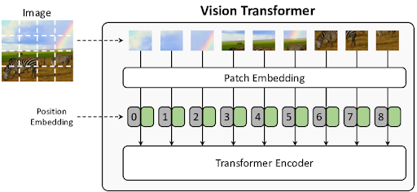

# Tutorial {.unnumbered}

O material do tutorial está dividido em duas partes, uma referente ao
pré-processamento das imagens, a outra ao código para fazer a similaridade
entre uma nova imagem com as imagens existentes na base de dados.

Abaixo será detalhado o modelo utilizado, ferramentas e resultados importantes
para acompanhamento do tutorial.

## Modelo ViT

### Introdução ao Vision Transformer (ViT)

O Vision Transformer (ViT) é uma arquitetura de modelo para tarefas de visão computacional que aplica diretamente um Transformer padrão, uma arquitetura que se tornou o padrão de fato no Processamento de Linguagem Natural (PLN), a imagens.
A principal inovação do ViT é sua abordagem para processar imagens com o mínimo possível de modificações na arquitetura Transformer original.

Enquanto os Transformers se tornaram o padrão em Processamento de Linguagem Natural (PLN) [@vaswani2017attention], a visão computacional era dominada por Redes Neurais Convolucionais (CNNs).
Diferente das Redes Neurais Convolucionais (CNNs), que processam imagens usando filtros locais e hierárquicos, o ViT trata uma imagem como uma sequência de "palavras" ou patches. 
Essa abordagem dispensa a necessidade de uma estrutura convolucional, mostrando que a dependência de CNNs não é estritamente necessária para obter alto desempenho em tarefas de reconhecimento de imagem.

A abordagem do ViT demonstra que a dependência de convoluções não é necessária para alcançar um desempenho de ponta. A estratégia central é simples e poderosa:

1.  **Dividir** a imagem em uma grade de patches (recortes) de tamanho fixo.
2.  **Tratar** cada patch como um "token" (semelhante a uma palavra em uma frase).
3.  **Processar** essa sequência de patches com um Transformer Encoder padrão.

Quando pré-treinado em conjuntos de dados massivos, o ViT atinge resultados excelentes em tarefas de classificação de imagem, muitas vezes superando as CNNs e exigindo menos recursos computacionais para o treinamento.

### Arquitetura do ViT

A arquitetura do ViT é projetada para seguir o Transformer original o mais fielmente possível, garantindo escalabilidade e a reutilização de implementações eficientes de PLN.
O funcionamento do ViT pode ser dividido em três etapas principais, conforme ilustrado no diagrama do modelo.

#### 1. Divisão da Imagem e Geração de Embeddings

Para que um Transformer processe uma imagem 2D, ela é convertida em uma sequência 1D de tokens, o modelo primeiro processa a imagem de entrada da seguinte forma:

* **Divisão em Patches (Patching)**: Uma imagem de entrada com dimensões $x \in \mathbb{R}^{H \times W \times C}$ é dividida em uma sequência de $N$ patches achatados $x_{p} \in \mathbb{R}^{N \times (P^2 \cdot C)}$
    * `(H, W)` é a resolução da imagem original (e.g., 224x224).
    * `(P, P)` é a resolução de cada patch (e.g., 16x16).
    * [cite_start]`N = HW / P^2` é o número resultante de patches, que se torna o comprimento da sequência de entrada para o Transformer[cite: 54].

* **Projeção Linear (Patch Embeddings)**: Cada patch achatado é mapeado para um vetor de dimensão latente constante `D` através de uma camada linear (projeção linear) treinável.
O resultado é chamado de *patch embeddings*.

* **Embedding de Posição**: Como o Transformer não processa a ordem dos elementos nativamente, embeddings de posição 1D treináveis são somados aos patch embeddings para que o modelo aprenda a informação espacial e a estrutura da imagem.
O modelo aprende a codificar a distância e a estrutura da imagem na similaridade desses embeddings.

* **Token de Classificação `[class]`**: Inspirado no token `[CLS]` do modelo BERT [@devlin2019bert], um embedding treinável é adicionado ao início da sequência de patches. O estado final deste token na saída do encoder é usado como a representação agregada de toda a imagem para a tarefa de classificação.

#### 2. Transformer Encoder

A sequência de vetores de embedding resultante é passada por um Transformer Encoder padrão, que consiste em `L` blocos idênticos. Cada bloco contém duas sub-camadas principais:
1.  **Multi-Head Self-Attention (MSA)**: Permite que cada patch interaja com todos os outros patches, integrando informações de forma global desde a primeira camada.
2.  **Feed-Forward (MLP)**: Uma rede neural feed-forward de duas camadas com ativação GELU.

Normalização de camada (*LayerNorm*) é aplicada antes de cada bloco, e conexões residuais são usadas após cada sub-camada.
A MSA permite que o modelo integre informações de toda a imagem, mesmo nas camadas mais iniciais.

#### 3. Cabeça de Classificação (Classification Head)

Finalmente, a tarefa de classificação é realizada:

* Uma "cabeça" de classificação é anexada ao token `[class]` na saída do Transformer Encoder.
* Durante o pré-treinamento, essa cabeça é tipicamente um MLP com uma camada oculta. 
* Para o **fine-tuning** em uma nova tarefa, ela é substituída por uma única camada linear com `K` neurônios, onde `K` é o número de classes do novo dataset.

### Equações Fundamentais

O fluxo de dados através do ViT pode ser descrito pelas seguintes equações:

$$
z_0 = [x_{class}; x_p^1\mathbf{E}; x_p^2\mathbf{E}; \dots; x_p^N\mathbf{E}] + \mathbf{E}_{pos},
$$

$$
\mathbf{E} \in \mathbb{R}^{(P^2 \cdot C) \times D}, \mathbf{E}_{pos} \in \mathbb{R}^{(N+1) \times D} \quad (1)
$$

$$
z'_l = \text{MSA}(\text{LN}(z_{l-1})) + z_{l-1}, \quad l=1 \dots L \quad (2)
$$

$$
z_l = \text{MLP}(\text{LN}(z'_l)) + z'_l, \quad l=1 \dots L \quad (3)
$$

$$
y = \text{LN}(z_L^0) \quad (4)
$$

* **Eq. 1**: Constrói a sequência de entrada, combinando o token de classe `[class]`, os patch embeddings projetados (`E`), e os embeddings de posição (`E_pos`).
* **Eq. 2 & 3**: Descrevem o processamento dentro de cada uma das `L` camadas do Transformer, com as operações de Multi-Head Self-Attention (MSA) e MLP, juntamente com a normalização (LN) e as conexões residuais.
* **Eq. 4**: Extrai a representação final da imagem (`y`) a partir do primeiro token da sequência (classe) (`z_L^0`) na última camada.

### Dados de Treinamento e Dimensões

Um ponto crucial do ViT é sua relação com a quantidade de dados de treinamento.

### Viés Indutivo e Dependência de Dados

* O ViT possui muito menos **viés indutivo** específico para imagens (como localidade e equivariância à translação)  do que as CNNs. Em uma CNN, a localidade e a equivariância à translação são incorporadas em cada camada. No ViT, apenas as camadas MLP são locais, enquanto as camadas de auto-atenção são globais.
* Como consequência, o ViT **não generaliza bem quando treinado em conjuntos de dados de tamanho insuficiente**. Seu desempenho é modesto em datasets de médio porte (como o ImageNet) se comparado a ResNets de tamanho similar.
* No entanto, essa desvantagem desaparece quando o modelo é pré-treinado em **conjuntos de dados massivos (14M a 300M de imagens)**. Em grande escala, o ViT atinge ou supera o estado da arte, mostrando que o aprendizado de padrões a partir dos dados pode superar a necessidade de um viés indutivo forte.

### Conjuntos de Dados e Resolução

Para explorar a escalabilidade, os modelos ViT foram pré-treinados em datasets de tamanhos variados:

* **ImageNet**: 1.3 milhão de imagens e 1k classes.
* **ImageNet-21k**: 14 milhões de imagens e 21k classes.
* **JFT-300M**: 303 milhões de imagens de alta resolução e 18k classes.

A resolução das imagens durante o treinamento é tipicamente **224x224**. 
No entanto, para fine-tuning, é comum e benéfico usar resoluções mais altas, como **384x384** ou **512x512**, ajustando as embeddings de posição via interpolação 2D.

### Modelos e Desempenho

Existem diferentes variantes do ViT, baseadas nas configurações do BERT, como **ViT-Base**, **ViT-Large** e **ViT-Huge**, que variam em número de camadas, tamanho da dimensão oculta (`D`), e número de "cabeças" de atenção.

O principal resultado é que o ViT, quando pré-treinado no dataset JFT-300M, **supera as ResNets de última geração em diversas tarefas de classificação, exigindo substancialmente menos recursos computacionais para o pré-treinamento**.
Isso demonstra que a arquitetura Transformer, embora originalmente projetada para texto, é uma abordagem surpreendentemente eficaz e escalável para o reconhecimento de imagens em grande escala.
Notavelmente, eles fazem isso com um custo computacional de pré-treinamento significativamente menor do que modelos CNN concorrentes como o BiT [@kolesnikov2020big].

---

## FAISS

---

## Distância do Cosseno

---

## Remoção de Background

